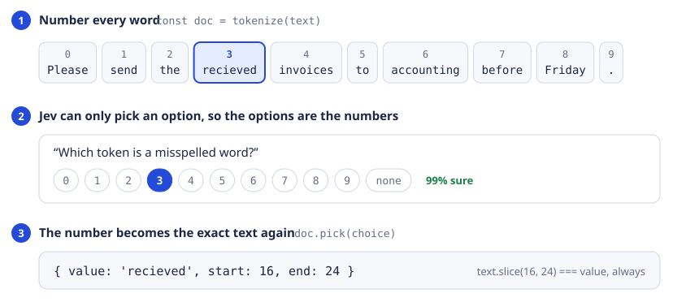

<div align="center">

# jeveryword

**It can't write. It can point.**

Get exact text out of [Jev](https://docs.typesafe.ai), TypeSafe's model that only answers multiple choice.

[](https://github.com/jkrup/jeveryword/actions/workflows/test.yml)   [](LICENSE)

[**Live demo**](https://jeveryword.vercel.app) · [Try it](#try-it) · [Fields](#pull-fields-out-of-a-message) · [Labels](#label-every-word) · [Any question](#ask-anything-else) · [For coding agents](#use-it-from-a-coding-agent)

<br>

<picture>
  <source media="(prefers-color-scheme: dark)" srcset="docs/how-it-works-dark.svg">
  
</picture>

</div>

<br>

Jev cannot hand you a name, an email, or a quote from a document, because it cannot write.
jeveryword numbers every word of your text, offers the numbers as the answer options, and
turns the numbers Jev picks back into the original substring.

- **Exact.** Every value is a slice of your text: `text.slice(start, end) === value`, always. Nothing can be invented.
- **Scored.** Every answer comes with a probability, so you know what to double-check.
- **Small.** No dependencies, about 500 lines, runs anywhere `fetch` does (Node, Workers, Deno, Bun).
- **Cheap and quick.** Ten fields from a short message: one call, a few hundred milliseconds, about $0.0004.

> Experimental. Checked on a handful of synthetic samples, not benchmarked. Try your own text in the [live demo](https://jeveryword.vercel.app).

## Try it

**In your terminal, right now.** No install, no API key (it runs on the shared demo):

```sh
npx github:jkrup/jeveryword "Hi, I'm Maya Chen from Fern Labs. Reach me at maya@fern.example" name company email phone
```

```
name     Maya Chen          [8, 17)    98%
company  Fern Labs          [23, 32)   98%
email    maya@fern.example  [46, 63)   98%
phone    — not in the text
```

Add `--pii` to find personal data instead. Or use the [live demo](https://jeveryword.vercel.app) in a browser.

**With your coding agent.** One command teaches Claude Code, Cursor, Codex and [70+ other agents](https://github.com/vercel-labs/skills) how to use it; then just ask ("pull the name and email out of each support message"):

```sh
npx skills add jkrup/jeveryword
```

[](https://cursor.com/link/prompt?text=Read%20https%3A//raw.githubusercontent.com/jkrup/jeveryword/main/skills/jeveryword/SKILL.md%20and%20follow%20it.%20Then%20use%20the%20jeveryword%20library%20in%20this%20project%20to%3A%20) or [paste a prompt](#use-it-from-a-coding-agent) into any agent.

**In your code.**

```sh
npm install github:jkrup/jeveryword
export TYPESAFE_API_KEY=…
```

```js
import { extractSpans, createJevClient } from 'jeveryword';

const evaluate = createJevClient({ apiKey: process.env.TYPESAFE_API_KEY });

const text = "Alex Smith sent me your way. I'm Maya Chen, a software engineer at Fern Labs. " +
  'My email is maya.old@example.com, actually use maya.chen@example.com.';

const { results } = await extractSpans({
  evaluate,
  text,
  fields: [
    { id: 'name',  description: "The speaker's full name, not somebody else's." },
    { id: 'role',  description: "The speaker's job title, without a leading article." },
    { id: 'email', description: "The speaker's current email. Respect explicit corrections." },
    { id: 'phone', description: "The speaker's phone number." },
  ],
});
```

```js
results.name   // { status: 'extracted', value: 'Maya Chen',             start: 33,  end: 42,  probability: 0.98 }
results.role   // { status: 'extracted', value: 'software engineer',     start: 46,  end: 63,  probability: 1 }
results.email  // { status: 'extracted', value: 'maya.chen@example.com', start: 125, end: 146, probability: 0.98 }
results.phone  // { status: 'missing',   value: null,                                          probability: 1 }
```

It skipped Alex, skipped the old email, and said the phone number is not there instead of guessing.

## Three tools

| You want | Use | One line |
| --- | --- | --- |
| Named fields out of a message | [`extractSpans`](#pull-fields-out-of-a-message) | `extractSpans({ evaluate, text, fields })` |
| A label for every word (PII, sentiment, entities) | [`classifyChunks`](#label-every-word) | `classifyChunks({ evaluate, text, labels })` |
| Anything else about a text | [`tokenize`](#ask-anything-else) | `tokenize(text)` → `doc.state`, `doc.options()`, `doc.pick()` |

### Pull fields out of a message

A field is an `id` and a plain-English `description`, and the description is the whole prompt
for that field. Say whose value you mean, which one when several appear ("the new number, not
the current one"), and what to leave out ("without a leading article").

Each result is one of:

```js
{ status: 'extracted', value: 'Maya Chen', start: 33, end: 42, probability: 0.99, tokenStart: 8, tokenEnd: 9 }
{ status: 'missing',   value: null, probability: 0.98 }   // not stated in the text
{ status: 'ambiguous', value: null, probability: 0.61 }   // several candidates, or an unclear boundary
```

`probability` is the weakest decision on the way to that answer, so it tells you what to confirm with the user:

```js
const shaky = Object.entries(results).filter(([, r]) => r.probability < 0.8);
```

Up to 16 fields and 20,000 characters per call. The return value also has `calls`,
`inputTokens`, `durationMs`, and a `trace` of every question and probability. Empty text
returns every field as `missing` without calling the model.

<details>
<summary><b>What it does so you do not have to</b></summary>

<br>

- Shared rules go in state once; each question is one short line plus bare ids.
- Span starts and ends are asked in the same request. A guessed end is kept only if it is
  confident and consistent with the start; otherwise it is asked again with the start as
  context.
- Text too long for one question is searched sentence-first: one request finds each
  field's sentence, then tokens are listed and searched only inside those sentences.
- A boundary with a serious rival token is settled by one small request that shows the
  competing spans as text. Jev's probabilities drift between runs; this removes most of
  the resulting flakiness.
- Trailing sentence punctuation is trimmed. Requests that exceed the token limit are
  shrunk and retried; text is never truncated.

Each step has a switch: `speculate`, `locate`, `verify`, `trimPunctuation` (all default
`true`). `fanout` (2 to 253, default 253) caps the options per question; lower values trade
more rounds for smaller requests. `tokenStart` and `tokenEnd` are the ids of the first and
last token, as `tokenize(text)` numbers them.

</details>

### Label every word

```js
import { classifyChunks, mergeChunks } from 'jeveryword';

const text = "Alex Smith sent me your way. I'm Maya Chen. Reach me at maya.chen@example.com.";

const scan = await classifyChunks({
  evaluate, text,
  labels: { none: 'Ordinary prose.', name: "A person's name.", contact: 'An email address or phone number.' },
  rules: 'Include every person mentioned, not only the speaker.',
});

mergeChunks(text, scan.detections, { threshold: 0.5 });
// [{ label: 'name',    value: 'Alex Smith',            start: 0,  end: 10, score: 0.95 },
//  { label: 'name',    value: 'Maya Chen',             start: 33, end: 42, score: 0.95 },
//  { label: 'contact', value: 'maya.chen@example.com', start: 56, end: 77, score: 1 }]
```

One tiny question per word, up to 96 per request, so a paragraph is a single call.
`scan.detections` has an entry for **every** word, `{ value, start, end, label, score,
probabilities }`, where `score` is `1 - P(none)`. `mergeChunks` keeps the words whose score
reaches `threshold` and joins neighbours that share a label. Because the scores are already
there, a UI slider can re-run `mergeChunks` at a new threshold without asking the model again.

`labels` must include a `none` option (rename it with `none: 'other'`); without one every
word is forced into a real label and the scores stop meaning anything.
[`examples/pii.mjs`](examples/pii.mjs) is a PII highlighter in about twenty lines of this.

### Ask anything else

The two helpers above are built on a small core that you can use directly. It knows nothing
about fields or PII; it only guarantees the round trip from text to numbers and back.

```js
import { tokenize } from 'jeveryword';

const doc = tokenize('Please send the recieved invoices to accounting before Friday.');

const { answers } = await evaluate({
  state: doc.state,          // { source_text, tokens: '0|Please\n1|send\n2|the\n3|recieved\n…' }
  questions: {
    typo: { type: 'choice', instructions: 'Which token is a misspelled word?', criteria: doc.options({ also: ['none'] }) },
  },
});

doc.pick(answers.typo.choice)   // { value: 'recieved', start: 16, end: 24 }, or null if it chose 'none'
```

For an answer longer than one word, ask where it starts and where it ends in the same request:

```js
const criteria = doc.options({ also: ['none'] });
const { answers } = await evaluate({ state: doc.state, questions: {
  first: { type: 'choice', criteria, instructions: 'FIRST token of the part where the customer says what they want done?' },
  last:  { type: 'choice', criteria, instructions: 'LAST token of the part where the customer says what they want done?' },
}});
const first = doc.decode(answers.first.choice), last = doc.decode(answers.last.choice);
if (first && last && first.lo <= last.hi) doc.resolve(first.lo, last.hi, { trim: true }); // { value, start, end }
```

Every answer carries `probabilities`, one number per option. (Jev adds `confidence` too: its
own 0 to 1 summary of how peaked those probabilities are.)

<details>
<summary><b>Core reference</b></summary>

<br>

| | |
| --- | --- |
| `tokenize(text, { chunker?, prefix? })` | Split the text into numbered tokens. `chunkers.tokens` (default) separates words, numbers and punctuation; `chunkers.words` keeps emails, phone numbers and ids whole; or pass your own `text => [{ text, start, end }]`. |
| `doc.list(ranges?)` | The `id\|token` lines for the model to read, optionally only some ranges. |
| `doc.state` | `{ source_text, tokens: doc.list() }`, ready to send. Add your own keys freely. |
| `doc.options({ lo?, hi?, fanout?, also? })` | Answer options: bare ids with `null` descriptions. With more tokens than `fanout` (max 253 per question) they become balanced id ranges such as `40-59`, to narrow over several rounds. `also` adds answers like `'missing'`. |
| `doc.decode(choice)` | `'12'` → `{ lo: 12, hi: 12 }`, `'40-59'` → `{ lo: 40, hi: 59 }`, anything else → `null`. |
| `doc.resolve(lo, hi?, { trim? })` | Ids back to `{ value, start, end, lo, hi }`. Also accepts a decoded range. `trim` drops trailing sentence punctuation. |
| `doc.pick(choice, { trim? })` | `decode` + `resolve` in one step; `null` for a non-id choice. |
| `doc.sentences()` | Sentence ranges, for narrowing long text before pointing at tokens. |
| `mergeChunks(text, detections, options?)` | Join neighbouring labelled words back into text spans. |

"Token" here means a word, number or punctuation mark of your text, not the sub-word tokens
a language model counts and bills.

Two details were learned the hard way. Bare ids with `null` descriptions cost far fewer
tokens than describing every option, because the numbered list already says what each id is.
And one `id|token` per line is what Jev reads reliably: with inline markers it kept choosing
the id after the word it meant.

</details>

## Bring your own model call

Everything that talks to a model takes an `evaluate` function:
`({ state, questions }) => Promise<{ answers }>`.

```js
// TypeSafe's SDK fits as-is
import { TypeSafeClient } from '@typesafe-ai/sdk';
const client = new TypeSafeClient();
const evaluate = request => client.systemOne(request);

// or the small dependency-free client in this package
import { createJevClient } from 'jeveryword';
const evaluate = createJevClient({ apiKey: process.env.TYPESAFE_API_KEY });

// or, in tests, a stand-in that needs no network or key: tell it the right answers
import { stubEvaluate } from 'jeveryword/testing';
const evaluate = stubEvaluate({ text, fields, values: { name: 'Maya Chen', phone: null } });   // for extractSpans
const evaluate = stubEvaluate({ text, labels: { Maya: 'name', Chen: 'name' } });               // for classifyChunks
```

On Vercel you do not need a key at all: AI Gateway accepts your project's own identity token.

```js
import { createJevClient, vercelGateway } from 'jeveryword';

export async function POST(request) {
  const evaluate = createJevClient({ gateway: vercelGateway(request), apiKey: process.env.TYPESAFE_API_KEY }); // key optional: fallback only
  …
}
```

The bundled client adds 429 handling that honors `Retry-After`, a typed
`max_tokens_exceeded` error the helpers use to shrink a request and retry, and an optional
[Vercel AI Gateway](https://vercel.com/ai-gateway) route that falls back to TypeSafe's API:
`createJevClient({ gateway: { token }, apiKey })`.

## Use it from a coding agent

```sh
npx skills add jkrup/jeveryword
```

That installs the [skill](skills/jeveryword/SKILL.md) into whichever agents you use (Claude Code, Cursor, Codex, OpenCode, Cline and more). Then ask for what you want in plain words.

Rather not install anything? Paste this into any agent and finish the sentence:

```text
Read https://raw.githubusercontent.com/jkrup/jeveryword/main/skills/jeveryword/SKILL.md and follow it.
Then use the jeveryword library in this project to:
```

<details>
<summary>Agent can't open links? Paste the long version</summary>

<br>

```text
Add the jeveryword library to this project and use it for the task below.
jeveryword lets TypeSafe's Jev (a multiple-choice-only model) return exact text: it numbers a
text's tokens, Jev picks numbers, the library maps them back to the verbatim substring with offsets.

Read https://github.com/jkrup/jeveryword/blob/main/skills/jeveryword/SKILL.md first and follow it.
Essentials if you cannot open it:
- npm install github:jkrup/jeveryword   (ESM only; server-side; needs TYPESAFE_API_KEY in the environment, never in browser code)
- import { createJevClient, extractSpans, classifyChunks, mergeChunks, tokenize } from 'jeveryword'
- const evaluate = createJevClient({ apiKey: process.env.TYPESAFE_API_KEY })
- Named fields: const { results } = await extractSpans({ evaluate, text, fields: [{ id, description }] })
  each result: { status: 'extracted' | 'missing' | 'ambiguous', value, start, end, probability }
- A label per word: const { detections } = await classifyChunks({ evaluate, text, labels: { none: '…', myLabel: '…' } })
  then mergeChunks(text, detections, { threshold: 0.5 }) → [{ label, value, start, end, score }]
- Anything else: const doc = tokenize(text); send { state: doc.state, questions: { q: { type: 'choice',
  instructions, criteria: doc.options({ also: ['none'] }) } } } to evaluate; then doc.resolve(doc.decode(answers.q.choice))
- Values are verbatim spans only. If a value must be computed or reformatted (a date, a total), extract the
  span and convert it in code. Handle 'missing' and 'ambiguous'; confirm anything with probability under 0.8.
- Add a test asserting text.slice(start, end) === value.

Task: <describe what you want extracted, labelled or found, and where in the app>
```

</details>

## What to expect

Measured on single runs at Jev's list price of $42 per billion input tokens:

| Task | Input tokens | Calls | Cost |
| --- | ---: | ---: | ---: |
| 10 fields from a 210-character message | 9,234 | 1 | $0.0004 |
| 10 fields from a 270-character message with corrections | 11,860 | 2 | $0.0005 |
| 10 fields buried in a 2,086-character message | 7,337 | 2 | $0.0003 |
| PII labels for 56 words, 13 categories | 6,832 | 1 | $0.0003 |
| PII yes/no for 56 words | 2,798 | 1 | $0.0001 |

All fields matched on these samples. That is an anecdote, not an accuracy claim.

| Good fit | Poor fit |
| --- | --- |
| Short text handled live: chat forms, intake, PII highlighting | Long documents |
| You need the exact span and where it is | Values that must be computed or reformatted ("next Tuesday", "thirty-six") |
| You want a probability for every decision | Answers spread across several sentences |
| Output that can only ever be text from the source | Bulk offline jobs, where a small LLM with JSON output costs less |

<details>
<summary><b>Errors, types and untrusted input</b></summary>

<br>

Thrown errors carry a `code`: `invalid_input` (your arguments; the message names the field or
option at fault), `invalid_answer` (the model function returned a choice that was not offered;
the message says which question and what was received, which is what you need when writing
your own `evaluate`), and from the bundled client `max_tokens_exceeded` and `rate_limited`.
TypeScript declarations ship with the package.

On untrusted input: the model can only ever answer with ids, so text cannot make it produce
words that are not in the source, and every prompt tells it the text is data. Text can still
influence **which** span it points at. Treat `probability` and your own validation as the
check, not the prompt.

</details>

## Run the examples

```sh
export TYPESAFE_API_KEY=…
node examples/custom-question.mjs   # the core alone: find a typo
node examples/extract.mjs           # fields out of a message
node examples/pii.mjs "Call Maya Chen on +1 (415) 555-0123."
npm test                            # stand-in model, no network
```

<div align="center">
<br>

[Live demo](https://jeveryword.vercel.app) · [TypeSafe docs](https://docs.typesafe.ai) · MIT license

</div>
